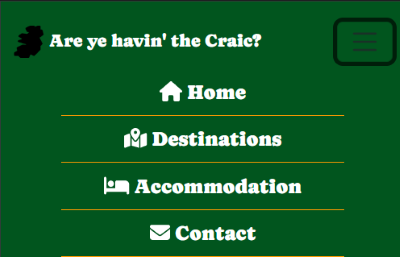
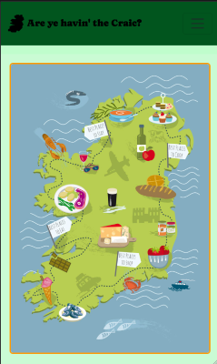
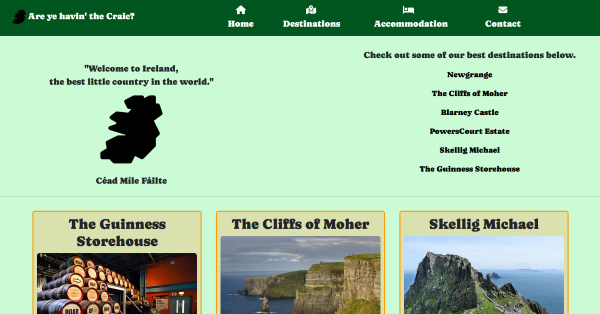
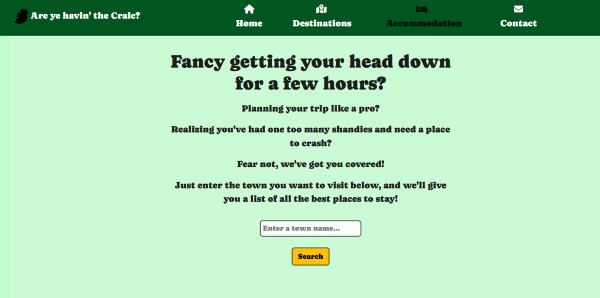
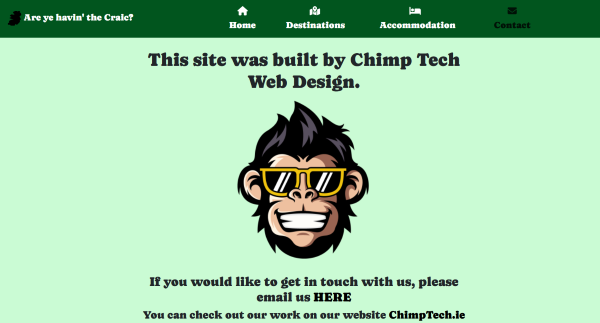

# Are ye havin' the Craic?
#### Information site on Irish Tourism, with a function to search accommodation from over 2000 locations around Ireland.

## Table of Contents

- [Description](#description)
- [Theme](#theme)
- [Features](#features)
- [Technologies](#technologies)
- [Credits](#credits)
- [Author Info](#author-info)

------

## Description
I would like to present my project, a tourist site that highlights some of Ireland's finest destinations and offers a convenient way for users to search for accommodations. The purpose of this project is to provide a comprehensive platform for tourists to explore and plan their trips to Ireland. Users can navigate through a curated selection of Ireland's most captivating locations, including breathtaking landscapes, historical landmarks, and culturally significant sites. Our site simplifies the process of finding suitable accommodations by offering a search functionality that allows users to filter results based on their preferences. Whether it's a desire to experience the dramatic Cliffs of Moher, soak in the vibrant atmosphere of Dublin, or discover anything else Ireland has to offer, our platform ensures that users can easily access the information they need to make informed decisions about their travel arrangements. By showcasing Ireland's rich heritage, folklore, and warm hospitality, we aim to assist and inspire travelers in planning memorable experiences that truly capture the essence of this remarkable country.

------
## Theme 
The theme of our project embodies a minimal, lighthearted, and uncluttered design that aims to provide an informative and enjoyable user experience. We have chosen a simple color palette that enhances usability and ensures visual coherence throughout the site. By employing clean lines, ample whitespace, and intuitive navigation, we create a sense of tranquility and ease of use. Our emphasis on simplicity allows users to focus on the content and the stunning imagery of Ireland's landscapes and attractions. Through thoughtful typography and carefully selected visuals, we aim to convey information in a clear and approachable manner. By adopting this minimalistic and lighthearted theme, we aspire to create an engaging platform that seamlessly guides users through their exploration of Ireland's best destinations, promoting a sense of delight and discovery at every step.

---

## Features

> ### Navigation menu 

On mobile and tablet devices the main navigation menu is housed inside a hamburger menu.
This opens up and reveals links to all four pages.
On laptops or bigger devices the menu is spread across the header bar which also contains the logo.

---

> ### Home Page  

This page gives a brief introduction to Ireland and the many reasons for wanting to visit.

---

> ### Destinations Page 

This page showcases 6 of Ireland's most popular destinations.(provided by the NCI)

---

> ### Accommodation Page 

Here you will find a form that allows the user to search towns or cities in Ireland and find accommodation nearby.

---

> ### Contact Page 

Here you will find information on the site's creator and a ways to contact them.

[Back to the Top](#table-of-contents)

---

## Technologies

- HTML
- CSS
- Bootstrap
- React
- Git
- GitHub
- Visual Studio Code
- Markdown
- FontAwesome
- Google Fonts

#### Resources

- NCI Curriculum
- YouTube
- Udemy
- FreeCodeCamp
- W3Schools.com
- MDN Web Docs

[Back to the Top](#table-of-contents)

---

## Credits

- Bootstrap
    - The Bootstrap Library was used throughout the project to make the site responsive and to add features such as the navigation menu and the footer.
    - [Bootstrap](https://getbootstrap.com/)
- FontAwesome
    - The FontAwesome Library was used to add icons to the navigation menu and the footer.
    - [FontAwesome](https://fontawesome.com/)
- Google Fonts
    - Google fonts were used to import the 'Caprasimo' font into the style.css file which is used on all pages throughout the project.
    - [Google Fonts](https://fonts.google.com/)    

[Back to the Top](#table-of-contents)

---

## Author Info

Ken Sheridan, Full Stack Software Developer.
- [GitHub](https://github.com/KSheridan86)
- [Linkedin](https://www.linkedin.com/in/kensheridan86/)

[Back to the Top](#table-of-contents)
